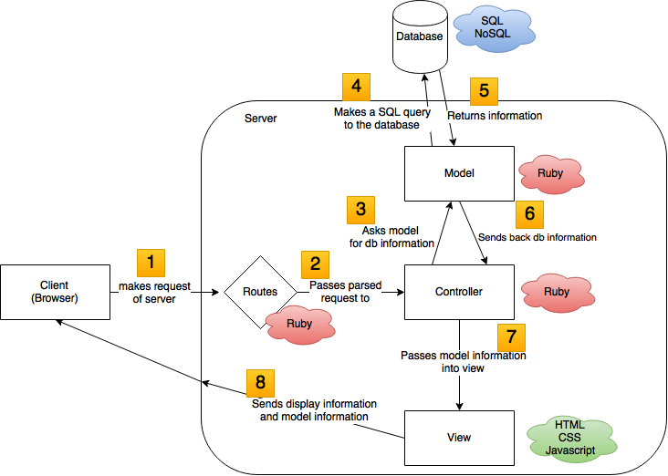

# Model-View-Controller and other paradigms of web development

!

### Learning Objectives

- Understand the landscape of client-server relations as viewed through MVC

!

### Next Week: Ruby

Note: It gets more technical.

Here's the conceptual bigger picture that we're working toward.

!

### Internet Redux

1. Client makes an HTTP request to the server for some webpage
2. Server receives the client's request
3. Server parses the request and goes into its file system and grabs:
    - Information from the database
    - How to present the information from HTML/CSS/Javascript files

!

### Before MVC

!

### Before MVC

- HTML code had server code
- HTML code had CSS code
- An app can be built with one single long script

!

### Problem

- If you had needed to display two of the same things from the database (example: a 200-pixel image of a cat), there would be two separate elements for it.
- Changing it would mean changing it twice.
- Repeated elements were not encapsulated, so changing code was a long and arduous process.

!

### Model-view-controller paradigm

- Attempts to solve the problem of poor encapsulation by breaking them out to distinct concepts
- A paradigm from 1970s, finally popularized with open source frameworks like Rails, Django, CakePHP, iOS

!

### Model-view-controller paradigm

!

### Server

- The server runs server side code (Ruby) to process a client's request.
- It first directs the request to the 'routes' file.

!

### Routes

- Based on the logic written in Ruby in the 'routes' file, it parses the user's request (e.g., `yourwebsite.com/about-me`)
- The `about-me` in a URL lets the route know that the user wants the `about-me` page.
- The 'routes' file parses the `about-me` request and finds the 'controller' file that can find you the relevant information on the `about-me` page.

!

### Controller

- The controller that 'controls' the `about-me` page will then look for the relevant information that should be displayed (e.g., name information stored in the database and an HTML file that says to display the names in a table)
- The controller finds the 'model' file that handles retrieving name information from the database.

!

### Model

- The 'model' file handles the controller's request to get information from the database ('name information'), translates the request into Structured Querying Language (if it's a SQL database), and passes the information back to the controller from the database.

!

### Views

- The controller passes the information received from the model into a 'view' file, which is written in HTML and references a CSS file.
- The 'view' file acts as a template. Instead of writing in all the name information as HTML, it allots some space for information to be passed in. That way, information can be <strong>dynamic</strong>.
- The 'view' file adds in the information into a table and sends the newly generated static HTML back to the client.

!

### And that's one request

!

### Takeaway

- When you start to lose hope and wonder why we're learning about the nitty-gritty bits of a programming language or a tool (like Ruby, git, etc.), remember that all these players have a part.
- Learning an entire system from the sum of its parts is difficult, so keep this bigger picture in mind.
